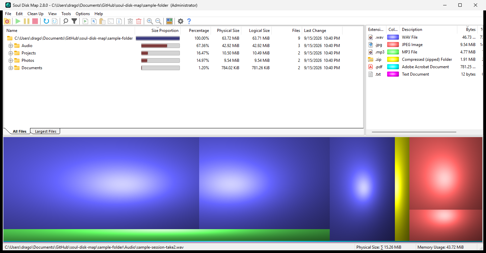

# Soul Disk Map

A cosmetic rebrand of [WinDirStat](https://github.com/windirstat/windirstat) — the
disk usage analyzer and treemap viewer for Windows.

**This is not the WinDirStat project, and is not affiliated with or endorsed by it.**
All of the actual engineering here is WinDirStat's. This repository changes the app's
name, icon, and one line of its About dialog, and nothing else.



## What this actually is

WinDirStat `release/v2.8.0` with a four-line branding patch applied:

| File | Change |
|---|---|
| `windirstat/windirstat.rc` | `AFX_IDS_APP_TITLE` → `"Soul Disk Map"` |
| `windirstat/windirstat.rc` | `IDR_MAINFRAME ICON` → `res\SoulDiskMap.ico` |
| `windirstat/res/langs/lang_en.txt` | Prepends `Soul Disk Map — based on WinDirStat` to the About text |
| `windirstat/res/langs/lang_en.txt` | `IDS_ABOUT_TITLE` → `About Soul Disk Map` |
| `windirstat/res/SoulDiskMap.ico` | New original icon (added, not replacing upstream's) |

No `.cpp` or `.h` file is modified. Scanning, the treemap, cleanup, and every other
behavior are upstream's, untouched. The full patch is in
[`soul-disk-map-branding.patch`](soul-disk-map-branding.patch).

Deliberately left alone: `LICENSE.md`, `res/license.txt`, and `CONTRIBUTORS.md` are
byte-identical to upstream. Every About credit — Bernhard Seifert, Oliver Schneider,
Bryan Berns, the KDirStat / Stefan Hundhammer attribution, the "Thanks To" list, and
`Copyright © WinDirStat Team` — remains verbatim and in place. The branding line is
added *above* those credits, never substituted for them. `version.rc` is untouched, so
the file's own properties still report WinDirStat and the upstream version: the binary
stays honest about where it came from.

## Download and run

Grab [`portable/SoulDiskMap-x64/SoulDiskMap.exe`](portable/SoulDiskMap-x64) — x64 only,
fully portable, no installer. MFC is linked statically, so there are no dependencies to
install. Copy the folder anywhere, including a USB stick.

```
SHA-256  851147d83def7911047f0844095221ca5ad3ef3a281f209f0c3653f748267c88
Size     4,530,688 bytes
```

Command-line scan to CSV works the same as upstream:

```
SoulDiskMap.exe C:\some\path /saveto scan-result.csv
```

## Build from source

See [BUILD.md](BUILD.md). Short version: Visual Studio 2022 Build Tools with the
**ATLMFC** component (required — the project sets `UseOfMfc=Static`), then

```bat
"...\BuildTools\Common7\Tools\VsDevCmd.bat" -arch=amd64
msbuild windirstat.sln /p:Configuration=Release /p:Platform=x64 /m
```

The complete corresponding source is vendored in [`upstream/`](upstream) at commit
`579dd76d6870b4efbb9497644698155fdab84284`. Do not use upstream's `build.cmd` — it also
code-signs, builds an MSI and MSIX packages, and makes 7-Zip archives, none of which
apply here.

## Verification

[VERIFICATION.md](VERIFICATION.md) records what was actually checked on the build
machine rather than assumed: the running binary's About dialog independently reports
the upstream commit hash, the patch reapplies cleanly to a fresh `release/v2.8.0`
checkout with a byte-identical icon, and a scan of a known test tree matched expected
sizes exactly (4,600,020 logical bytes across 5 files and 4 folders).

Not built or tested: x86 and ARM64, MSI/MSIX packaging, code signing, deletion and
cleanup operations, non-English About text, and long-running whole-drive scans.

### Known side effect

The CSV export column `WinDirStat Attributes` is emitted as `Soul Disk Map Attributes`,
because `CsvLoader.cpp` derives that header from the app title string. CSVs still load
in either direction — unknown columns are skipped silently — but that one column will
not carry across to or from a stock WinDirStat build. Fixing it would require a source
change, which is outside this fork's branding-only scope.

## License

GPL-2.0, inherited from WinDirStat. See [LICENSE.md](LICENSE.md). The upstream
copyright and contributor notices are preserved in
[`upstream/CONTRIBUTORS.md`](upstream/CONTRIBUTORS.md) and shipped alongside the
executable.

If you want the real thing, go to [windirstat.net](https://windirstat.net) and
[github.com/windirstat/windirstat](https://github.com/windirstat/windirstat).
Consider supporting the upstream project — they wrote everything that makes this useful.
